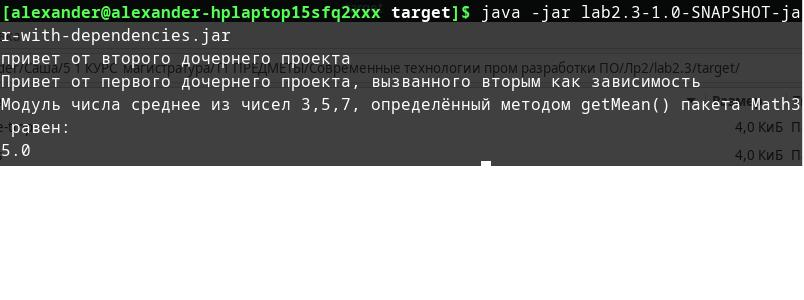

= Отчет по лабораторной работе 2
:listing-caption: Листинг
:source-highlighter: coderay

Студент: Беляев Александр

Группа: ИВМ-22

== 1. Задание на лабораторную работу

. Создать несколько maven-проектов:
    - Родительский
    - 2 Дочерних (1 дочерний проект зависит от второго)
. Подключить внешнюю зависимость (из глобального репозитория) в один из проектов и продемонстрировать работу этой зависимости.
. Создать maven-проект, который будет помещен в локальный репозиторий. Добавить этот проект как зависимость в проект из п.1
. Создать maven-проект, упаковать его в jar-with-dependencies, продемонстрировать рабту jar. Запустить проект с помощью maven.
. Выполнить тест подключенной зависимости из п.2 с помощью junit

== 2. Выполнение задания

=== 2.1 Создание проектов

В корневом каталоге созданы с помощью комнды mvn archetype:generate maven-проекты с именами: lab2.1, lab2.2, lab2.3 (соответствующие идентификаторы артефактов вводились при создании проктов). При этом проект lab2.1 будет определён как родительский для других, а проет lab2.3 будет зависеть от проекта lab2.2 (вызывать метод определённый в нём).

В каждом каталоге автоматически созданы файлы pom.xml, а также один исполняемый java-класс (по пути, указанному в groupid) и один класс, содержащий тесты.

=== 2.2 Написание исходных текстов классов

Исходный текст класса App2, содержащегося в проекте lab2.2:

[source,java]
----
package ru.rsatu;
import org.apache.commons.math3.stat.descriptive.DescriptiveStatistics;

public class App2 
{
    public static void main( String[] args )
    {
        System.out.println( "Привет от первого дочернего проекта" );
    }
    public static void Vivod()
    {
        System.out.println( "Привет от первого дочернего проекта, вызванного вторым как зависимость" );
        System.out.println( "Среднее из чисел 3,5,7, определённый методом getMean() пакета Math3 равен:" );
        double[] values = new double[]{3,5,7};
	    DescriptiveStatistics ds = new DescriptiveStatistics();
	    ds.addValue(values[0]);
	    ds.addValue(values[1]);
	    ds.addValue(values[2]);
	    System.out.println(ds.getMean());
    }
}
----
В данном классе определён метод Vivod, который будет вызван из класса App3

Исходный текст класса App3, содержащегося в проекте lab2.3:
[source,java]
----
package ru.rsatu;

import ru.rsatu.App2;
public class App3 
{
    public static void main( String[] args )
    {
        System.out.println( "привет от второго дочернего проекта" );
	    App2.Vivod();
    }
}

----

Дынный класс выводит строку в консоль и вызывает метод из класса App2.

=== 2.3 Настройка pom-файлов

pom-файл проекта lab2.1 имеет следующий вид:

[source,xml]
----
<?xml version="1.0" encoding="UTF-8"?>

<project xmlns="http://maven.apache.org/POM/4.0.0" xmlns:xsi="http://www.w3.org/2001/XMLSchema-instance"
  xsi:schemaLocation="http://maven.apache.org/POM/4.0.0 http://maven.apache.org/xsd/maven-4.0.0.xsd">
  <modelVersion>4.0.0</modelVersion>

  <groupId>ru.rsatu</groupId>
  <artifactId>lab2.1</artifactId>
  <version>1.0-SNAPSHOT</version>
  <packaging>pom</packaging>

  <name>lab2.1</name>
  <!-- FIXME change it to the project's website -->
  <url>http://www.example.com</url>

  <properties>
    <project.build.sourceEncoding>UTF-8</project.build.sourceEncoding>
    <maven.compiler.source>1.7</maven.compiler.source>
    <maven.compiler.target>1.7</maven.compiler.target>
  </properties>

  <dependencies>
    <dependency>
      <groupId>org.apache.commons</groupId>
      <artifactId>commons-math3</artifactId>
      <version>3.6.1</version>
    </dependency>

    <dependency>
      <groupId>junit</groupId>
      <artifactId>junit</artifactId>
      <version>4.11</version>
      <scope>test</scope>
    </dependency>
  </dependencies>

  <build>
    <pluginManagement><!-- lock down plugins versions to avoid using Maven defaults (may be moved to parent pom) -->
      <plugins>
        

      </plugins>
    </pluginManagement>
  </build>
</project>
----

В этот файл добавлена зависимость, полученная из внешнего репозитория (Math).
Данная зависимость используется в классе App2, определённом в проекте lab2.2.

pom-файл проекта lab2.2 имеет следующий вид:

[source,xml]
----
<?xml version="1.0" encoding="UTF-8"?>

<project xmlns="http://maven.apache.org/POM/4.0.0" xmlns:xsi="http://www.w3.org/2001/XMLSchema-instance"
  xsi:schemaLocation="http://maven.apache.org/POM/4.0.0 http://maven.apache.org/xsd/maven-4.0.0.xsd">
  <modelVersion>4.0.0</modelVersion>

  <parent>
    <groupId>ru.rsatu</groupId>
    <artifactId>lab2.1</artifactId>
    <version>1.0-SNAPSHOT</version>
    
  </parent>

  <groupId>ru.rsatu</groupId>
  <artifactId>lab2.2</artifactId>
  <version>1.0-SNAPSHOT</version>

  <name>lab2.2</name>
  <!-- FIXME change it to the project's website -->
  <url>http://www.example.com</url>

  <properties>
    <project.build.sourceEncoding>UTF-8</project.build.sourceEncoding>
    <maven.compiler.source>1.7</maven.compiler.source>
    <maven.compiler.target>1.7</maven.compiler.target>
  </properties>

  <dependencies>
    <dependency>
      <groupId>junit</groupId>
      <artifactId>junit</artifactId>
      <version>4.11</version>
      <scope>test</scope>
    </dependency>
  </dependencies>
 
  <build>
    <pluginManagement><!-- lock down plugins versions to avoid using Maven   <plugins>
      </plugins>
    </pluginManagement>
  </build>
</project>

----
В данный файл явно не включена зависимость от Math, но указан родительский проект, в котором содержится данная зависисмоть и она будет подключена и к этому проекту.

pom-файл проекта lab2.3 имеет следующий вид:

[source,xml]
----
<?xml version="1.0" encoding="UTF-8"?>

<project xmlns="http://maven.apache.org/POM/4.0.0" xmlns:xsi="http://www.w3.org/2001/XMLSchema-instance"
  xsi:schemaLocation="http://maven.apache.org/POM/4.0.0 http://maven.apache.org/xsd/maven-4.0.0.xsd">
  <modelVersion>4.0.0</modelVersion>

  <parent>
    <groupId>ru.rsatu</groupId>
    <artifactId>lab2.1</artifactId>
    <version>1.0-SNAPSHOT</version>
    
  </parent>

  <groupId>ru.rsatu</groupId>
  <artifactId>lab2.3</artifactId>
  <version>1.0-SNAPSHOT</version>
  <packaging>jar</packaging>

  <name>lab2.3</name>
  <!-- FIXME change it to the project's website -->
  <url>http://www.example.com</url>

  <properties>
    <project.build.sourceEncoding>UTF-8</project.build.sourceEncoding>
    <maven.compiler.source>1.7</maven.compiler.source>
    <maven.compiler.target>1.7</maven.compiler.target>
  </properties>

  <dependencies>
    <dependency>
      <groupId>ru.rsatu</groupId>
      <artifactId>lab2.2</artifactId>
      <version>1.0-SNAPSHOT</version>
      <scope>compile</scope>
    </dependency>

    <dependency>
            <groupId>org.junit.jupiter</groupId>
            <artifactId>junit-jupiter-engine</artifactId>
            <version>5.3.1</version>
            <scope>test</scope>
        </dependency>

  </dependencies>

  <build>
    <pluginManagement><!-- lock down plugins versions to avoid using Maven defaults (may be moved to parent pom) -->
      <plugins>
        <!-- clean lifecycle, see https://maven.apache.org/ref/current/maven-core/lifecycles.html#clean_Lifecycle -->
          
        <plugin>
          <artifactId>maven-assembly-plugin</artifactId>
          <configuration>
           <archive>
             <manifest>
              <mainClass>ru.rsatu.App3</mainClass>
             </manifest>
           </archive>
          <descriptorRefs>
            <descriptorRef>jar-with-dependencies</descriptorRef>
          </descriptorRefs>
        </configuration>
        <executions>
          <execution>
            <id>make-assembly</id> <!-- this is used for inheritance merges -->
            <phase>package</phase> <!-- bind to the packaging phase -->
            <goals>
              <goal>single</goal>
            </goals>
          </execution>
        </executions>
      </plugin>
   
        
      </plugins>
    </pluginManagement>
  </build>
</project>
----

В данном файле указана зависимость от проекта lab2.2, в котором определён класс App2, метод которого вызывается из класса App3. Помимо этого в данном классе добавлен плагин, обеспечивающий формирование jar-файла, содержащего все зависимости.Этот плагин будет работать тогда, когда будет указана цель "single".

=== 2.4 Написание текста класса тестов

Класс тестов в проете lab2.3 имеет следующий исходный текст:

[source,java]
----
package ru.rsatu;

import static org.junit.Assert.assertTrue;
import org.junit.jupiter.api.Test;
import static org.junit.jupiter.api.Assertions.assertEquals;
import org.apache.commons.math3.stat.descriptive.DescriptiveStatistics;

public class AppTest 
{
    
    @Test
    public void shouldAnswerWithTrue()
    {
        assertTrue( true );
    }

    @Test
    public void testAbs()
    {
	    double[] values = new double[]{1,3,5};
	    DescriptiveStatistics ds = new DescriptiveStatistics();
	    ds.addValue(values[0]);
	    ds.addValue(values[1]);
	    ds.addValue(values[2]);
	
        assertEquals(3, ds.getMean());
    }
}

----
В дополнение к стандартному тесту, создан тест библиотеки Math3, который проверяет корректность результата выполнения операции нахождения среднего  путём сравнения результата операции с заданным значением.

=== 2.5 Сборка проектов

Сборка проектов выполняется командами из терминала:

Также на рисунке выше видно, что были выполнены и пройдены оба теста (выделение на рис. выше).

По результатам сборок в локальном репозитории появились собранные проекты:

Это позволяет использовать их как зависисмости в других проектах.

Также выполнена сборка jar-файла, содержащего зависисмости, для этого выполнена команда:

При этом указана цель "single", которая указывает на необходимость работы плагина. В результате получен файл, содержащий все зависимости:

=== 2.6 Запуск проекта

Запуск проета возможно произвести из maven, для этого необходимо выполнить команду: mvn compile exec:java -Dexec.mainClass="ru.rsatu.App3".
В этой команде явно указывается класс, который необходимо запустить.
В результате работы программа вывела на экран строки:

Одна строка выведена непосредственно методом класса App3, а другие выведены вызванным из него методом класса App2, который в свою очередь для вычисления моделя вызвал метод из класса DescriptiveStatistics. являющегося внешней зависимостью (данная зависисмость указана в pom-файле родительского проекта).

Созданный jar-файл, содержащий все зависисмости можно запустить стандартной командой java -jar lab2.3-1.0-SNAPSHOT-jar-with-dependencies.jar
Результат выполнения команды и работы программы:

Программа выполнилась корректно.

== 3. Вывод

В ходе выполнения лабораторной работы были получены первоначальные навыки работы с системой сборки Maven: создания проектов и их первоначальное конфигурирование, добавление как внешних, так и локальных зависимостей, создания и выполнения модульных тестов, сборки единого файла, содержащего все зависимости, а также запуска проектов.