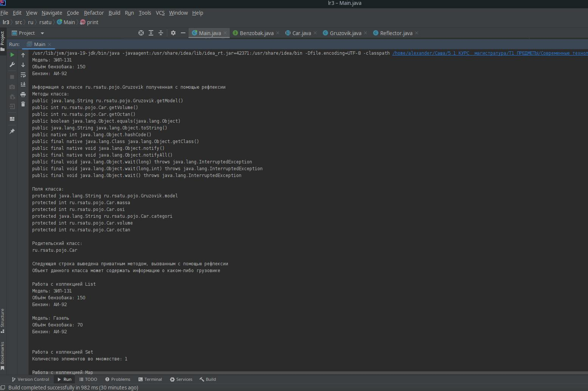
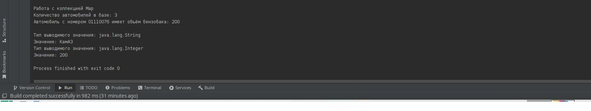

= Отчет по лабораторной работе 3
:listing-caption: Листинг
:source-highlighter: coderay

Студент: Беляев Александр

Группа: ИВМ-22

== 1. Задание на лабораторную работу

. ООП.
.. Создать интегрфейс
.. Создать абстрактный класс
.. Создать класс, имплементирующий интерфейс
.. Создать класс-наследник абстрактного класса

. Reflection
.. Выгрузить все поля и методы класса с помощью рефлексии
.. Вызвать несколько методов класса
.. Вывести на экран всех предков класса

. Collections
.. Ознакомится со всеми коллекциями java (list, set, map) и их реализацией
.. Продемонстрировать в программе работу с каждым видом реализации коллекции (list, set, map)

. Generics
.. Сделать дженерик на класс
.. Сделать дженерик на метод

== 2. Выполнение задания

=== 2.1 Создание интерфейса

В качестве примера интерфейса создан интерфейс Benzobak:
[source,java]
----
package ru.rsatu.pojo;

public interface Benzobak {
    int getVolume();//получение объёма бензобака
    int getOctan();//получение октанового числа безина
}
----

Данный интерфес объявляет 2 метода: получение объёма бензобака (все значения, использованные в программе являются условными) и получение октанового числа бензина (например, это может использоваться на транспортном предприятии для определения нормы заправки).

=== 2.2 Создание абстрактного класса, реализующего интерфейс Benzobak

В качестве примера абстрактного класса создан класс Car, который частично описывает некоторую модель автомобиля: его массу, количество осей, категорию ТС, объём бензобака и октановое число бензина:

[source,java]
----
package ru.rsatu.pojo;

public abstract class Car implements Benzobak{

    protected int massa;  //масса автомобиля
    protected int osi;  //количество осей
    protected String categori;//категория автомобиля
    protected int volume;
    protected int octan;

    public Car(int massa, int osi, String categori, int volume, int octan) {
        this.massa = massa;
        this.osi = osi;
        this.categori = categori;
        this.volume = volume;
        this.octan = octan;
    }

    @Override
    public int getVolume() {

        return this.volume;
    }

    @Override
    public int getOctan() {
        return this.octan;
    }
}
----
Для этого класса создан конструктор, а также в нём реализованы методы, объявленные в интерфейсе.

== 2.3 Создание класса-наследника абстрактного класса
В качестве примера класса-наследника создан класс Gruzovik, который может содержать некоторую информацию о модели грузового автомобиля:

[source,java]
----
package ru.rsatu.pojo;

public class Gruzovik extends Car{

    protected String model;//модель автомобиля

    public String getModel() {
        return model;
    }

    private static void printOpisanie(){
        System.out.println("Объект данного класса может содержать информацию о каком-либо грузовике");
    }

    public Gruzovik(String model, int massa, int osi, String categori, int volume, int octan){
       super(massa, osi, categori, volume, octan);
       this.model=model;

    }

}
----

Для этого класса создан конструктор, который вызывает конструктор родительского класса, а после этого инициализирует новое поле.
Также создан метод, выводящий очень красткое описание назначения данного класса (этот метод создан для использования в задании с рефлексией), при жтом этот метод помечен как privat, что делает его недоступным для обращения извне стандартными способами.

== 2.4 Создание класса для работы с рефлексией

Для примера работы с рефлексией создан класс Rreflector:
[source,java]
----
package ru.rsatu.pojo;

import java.lang.reflect.Field;
import java.lang.reflect.InvocationTargetException;
import java.lang.reflect.Method;

public class Reflector {

    public void printMetodsandPrintParam(Class clazz) throws NoSuchMethodException, InvocationTargetException, IllegalAccessException {
        System.out.println("Информация о классе "+clazz.getName()+" полученная с помощью рефлексии");

        //методы
        System.out.println("Методы класса:");
        Method metods[] = clazz.getMethods();   //подучение методов класса
        for (Method m :metods){
            System.out.println(m);  //вывод названий методов класса
        }
        System.out.println();

        //поля
        System.out.println("Поля класса:");
        Field polia[]=clazz.getDeclaredFields();    //получение полей класса (без полей родительского класса)
        Field nasledpolia[]=clazz.getSuperclass().getDeclaredFields();
        for(Field f :polia){
            System.out.println(f);  //вывод полей
        }
        for(Field f :nasledpolia){
            System.out.println(f);  //вывод полей
        }

        //родитель
        System.out.println();
        Class supercl=clazz.getSuperclass();        //получение класса-родителя
        System.out.println("Родительский класс:");
        System.out.println(supercl.getName());

        System.out.println();
        System.out.println("Следующая строка выведена приватным методом, вызванным с помощью рефлексии");
        Method metod= clazz.getDeclaredMethod("printOpisanie");     //получение приватного метода по его имени
        metod.setAccessible(true);
        metod.invoke(new Object()); //вызов метода с помощью рефлексии

    }
}
----
Данный класс содержит один метод, который принимает в качестве параметра объект типа Class и обеспечивает вывод информации о нём: его методов, полей (включая унаследованные поля, которые получены как поля родительского класса) (при этом в данном методе может возникнуть ряз исключений, что указано при его объявлении), а также обеспечивает получение приватного метода, получение к нему доступа и его вызов (несмотря на то, что при объявлении класса этот метод был помечен как private).

== 2.5 Написание основного исполняемого метода, включая работу с коллекциями, а также обобщённого (Generics) метода

Для демонстрации работы описанных выше классов, а также для работы с основными видами коллекций написн основной исполняемый мотод main класса Main:

[source,java]
----
package ru.rsatu;

import ru.rsatu.pojo.Car;
import ru.rsatu.pojo.Gruzovik;
import ru.rsatu.pojo.Reflector;

import java.lang.reflect.InvocationTargetException;
import java.util.*;

public  class Main {

    public static void main(String args[]) throws NoSuchMethodException, InvocationTargetException, IllegalAccessException {

        //создание объекта - грузовика
        Gruzovik Zil=new Gruzovik("ЗИЛ-131",2000,3,"C",150,92);

        //вывод информации о грузокике
        System.out.println("Модель: "+Zil.getModel());
        System.out.println("Объём бензобака: "+Zil.getVolume());
        System.out.println("Бензин: АИ-"+Zil.getOctan());
        System.out.println();

        //работа с рефлексией
        Reflector reflect = new Reflector();

        reflect.printMetodsandPrintParam(Gruzovik.class);

        //Коллеклии
        //List
        System.out.println();
        System.out.println("Работа с коллекцией List");
        List<Gruzovik> listGruz=new LinkedList<Gruzovik>();
        listGruz.add(Zil);     //добавление существующего объекта
        listGruz.add(new Gruzovik("Газель",1500,2,"B",70,92));     //добаление нового объекта

        //вывод информации обо всех элементах списка
        for(Gruzovik g:listGruz){
            System.out.println("Модель: "+g.getModel());
            System.out.println("Объём бензобака: "+g.getVolume());
            System.out.println("Бензин: АИ-"+g.getOctan());
            System.out.println();
        }

        //Set
        System.out.println();
        System.out.println("Работа с коллекцией Set");

        Set<Gruzovik> setGruz= new HashSet<Gruzovik>();
        setGruz.add(Zil);   //добаление существующего объекта
        setGruz.add(Zil);       //попытка повторного добавления
        System.out.println("Количество элементов во множестве: "+setGruz.stream().count());

        //Map

        System.out.println();
        System.out.println("Работа с коллекцией Map");
        HashMap<String,Car> baza = new HashMap<>();     //создание словаря, ключ - строка (номер автомобиля), значение - объект Car
        Gruzovik Kamaz=new Gruzovik("КамАЗ",2500,3,"C",200,0);  //создание нового грузовика

        baza.put("А001АА76",Zil);   //добавление автомобилей в базу
        baza.put("О111ОО76",Kamaz);
        baza.put("P222TT76",Zil);

        System.out.println("Количество автомобилей в базе: "+baza.size());
        System.out.println("Автомобиль с номером О111ОО76 имеет объём бензобака: "+baza.get("О111ОО76").getVolume() );  //получение сведений об автомобиле по его номеру

        //работа с Generics
        System.out.println();
        //вывод данных с помощью обощённого метода
        print(Kamaz.getModel());
        print(Kamaz.getVolume());
    }

    public static <T> void print(T value){
        System.out.println("Тип выводимого значения: "+value.getClass().getName());
        System.out.println("Значение: "+value);
    }
}
----

В данном методе создаётся объект класса Gruzovik (ЗиЛ), информация о котором (модель, объём бензобака, октановое число бензина (все значения условны)) выводятся на экран.

После этого создаётся экземпляр класса Reflector и вызывается метод вывода информации (списка методов, полей, а также вызов приватного метода) о классе, в качестве параметра передаётся класс Gruzovik.

Далее описана базовая работа с коллекциями: создаётся ссылочный список элементов с типом Grozovik ("список на основе списка"), в который добавляются два элемента - существующий объект класса Gruzovik и новый. После этого для каждого жлемента списка выводится информация о модели, объёме бензобака и типе бензина.

Для примера работы с коллекцией Set выбрана реализация HashSet. Для демонстрации того, что в множестве могут существовать только уникальные элементы, осуществляется добавление в множество элемента Zil и его повторное добавление, после этого выводится количество элементов в множестве (элемент будет только один, т. к. второе добавление не будет осуществлено, но при этом исключения не возникнет).

В качестве примера работы с коллекцией Map использован класс HashMap, который позволяет добавлять и получать значения по уникальному ключу (при этом значения могут быть одинаковыми). В словать добавляются номера автомобилей в качестве ключа и объекты класса Gruzovik в качестве значений. После этого осущетвляется получение информации об объёме бензобака по номеру автомобиля (уникальному ключу).

Для демонстрации работы с обобщённым методом (неизвестен тип параметра) создан метод print, который получает некоторое значение неизвестного заранее типа, выводит его тип и само значение.
Данный метод вызывается из метода main два разаЮ при жтом в качестве параметров ему передаются сначала модель автомобиля - строка, а затем объём его бензобака - число.
Помимо методов обобщёнными могут быть и классы. Примером работы с обобщёнными (Generics) классами является работа с классами коллекций - все они являются обобщёнными и могут содержать элементы раздичных типов (типы элементов задаются при создании объектов этих классов).

Результат работы программы - строки, выведенные методами представлены на рисунках:

Все выведенные строки корректны, метод, объявленны приватным был вызван с помощью рефлексии и отработал, выведя очень краткое описание назначения класса Gruzovik.
В множестве действительно оказался только один элемент, т. к. была попытка плвторного добаления одного и того же объекта.
Обобщённый метод отработал два раза, при этом в качестве параметров были получены значения разных типов.

== 3. Вывод

В ходе выполнения лабораторной работы были получены первоначальные навыки работы с объектной моделью Java: создание интерфейсов, абстрактных классов, наследование.

Reflection позволяет получать информацию о классе в процессе выполнения прогрмаммы, обращаться к полям и вызывать методы классов, помеченные как private.

В Java реализован ряд коллекций, первоначальные навыки с которыми были получены в ходе выполнения лабораторной работы. List позволяет хранить элементы одного типа в виде массива или списка, Set предоставляет возможность работы с множеством, в том числе с контролью уникальности значений в множестве, Map позволяет хранить пары элементов ключ-значение, при этом ключи должны быть уникальными, а также быстро получать значение по ключу.

Использование обобщённых методов и классов позволяет избежать проблемы соответствия типов при создании универсальных классов и методов, в случае, когда на этапе разработки класса/метода не изветсно, со значениями каких конктретно типов необходимо будт его использовать.