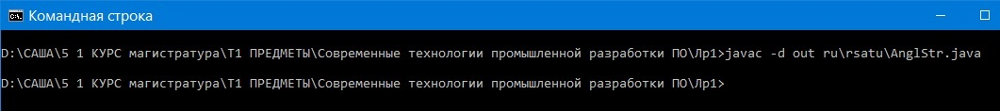
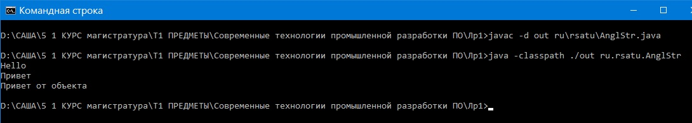
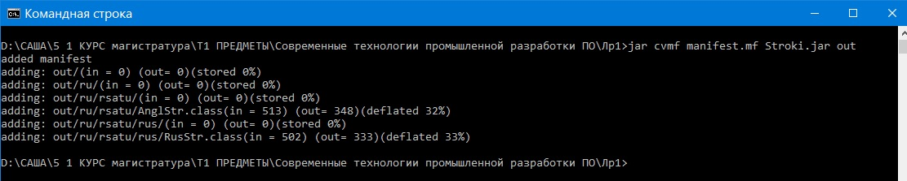

= Отчет по лабораторной работе 1
:listing-caption: Листинг
:source-highlighter: coderay

Студент: Беляев Александр

Группа: ИВМ-22

== 1. Задание на лабораторную работу

. Создать исполняемый java класс, который выводит текстовую строку на экран
. Разработать два класса. Первый класс вызывает 2 метода из второго класса (статический и нестатический)
. Создать jar-файл, хранящий элементы из предыдущего задания

== 2. Выполнение задания

В отчёте описано выполнение 3-го задания, так как оно предполагает выполнение и 1-го, и 2-го.

=== 2.1 Структура проекта

Проект разделен на следующие каталоги:

Корневой каталог Лр1::
Содержит файл manifest.mf, необходимый для создания jar-файла и созданный jar-файл, а также подкаталоги:

ru\rsatu\::
. Текст класса AnglStr, выводящего на экран английскую строку и вызывающего метода класса RusStr (этот класс содержит метод main).
. Каталог rus

ru\rsatu\rus::
Содержит файл класса RusStr, который имеет два метода - статический, выводящий на экран строку "Привет", и нестатический, выводящий на экран строку "Привет от объекта"

out\::
Содержит аналогичную иерархию каталогов, которые сожержат уже скомпилированные файлы классов

=== 2.2 Написание исходных текстов классов

Для выполнения первого задания были созданы классы AnglStr и RusStr.

. Исходный текст класса AnglStr

[source,java]
----
package ru.rsatu;

import ru.rsatu.rus.RusStr;

public class AnglStr{

	public static void main(String[] args){

		System.out.println("Hello");
		RusStr.Rus();

		RusStr rus=new RusStr();
		rus.Obect();

	}
}
----

. Исходный текст класса RusStr 

[source,java]
----
package ru.rsatu.rus;

public class RusStr{

	public static void Rus(){

		System.out.println("Привет");
	
	}

	public void Obect(){

		System.out.println("Привет от объекта");

	}
}
----

=== 2.3 Выполнение программы

Для компиляции классов в командной строке использовалась команда javac

Ключ -d позволяет указать каталог, в который необходимо пометсить скомпилированные файлы (автоматически создаются подкаталоги и компилируются все зависимые файлы)

Для интерпритации класса в командной строке использовалась команда java, на рисунке представлена команда и результат работы программы

Ключ -classpath позволяет указать каталог, в котором интерпретатору следует искать файлы классов.
Программа вывела на экран 3 строки - одну на английском языке (из класса AnglStr) и две на русском (из класса RusStr, одна выведена статическим методом, другая не статическим).

=== 2.4 Создание jar-файла

Jar-файл по сути представляет собой архив, хранящий все скомпилированные классы проекта.
Для создания jar-файла был создан файл manifest.mf, который содержыт краткое описание формируемого архива и класс, содержащий метод main.

[source,java]
----
Manifest-Version: 1.0
Created-By: Alexander Belyaev
Main-Class: ru.rsatu.AnglStr
----

Для создания jar-файла было вызвана команда jar

При вызове команды указывается имя файла манифеста, имя формируемого файла и каталог, который необходимо поместить в формируемый jar-файл.

== 3. Вывод

В ходе выполнения лабораторной работы были получены первоначальные навыки компиляции и запуска Java-классов из командной строки, а также создания jar-файлов.